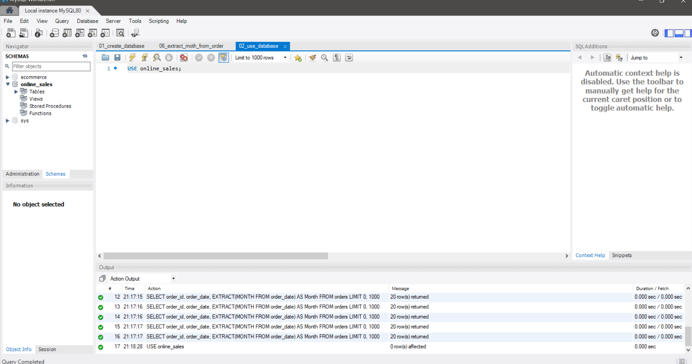
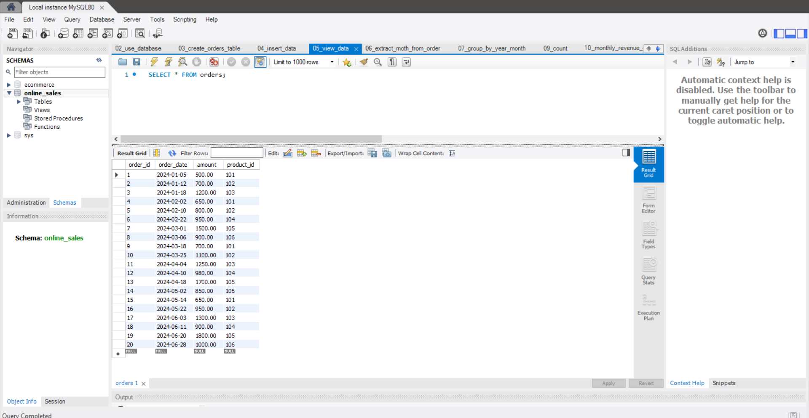
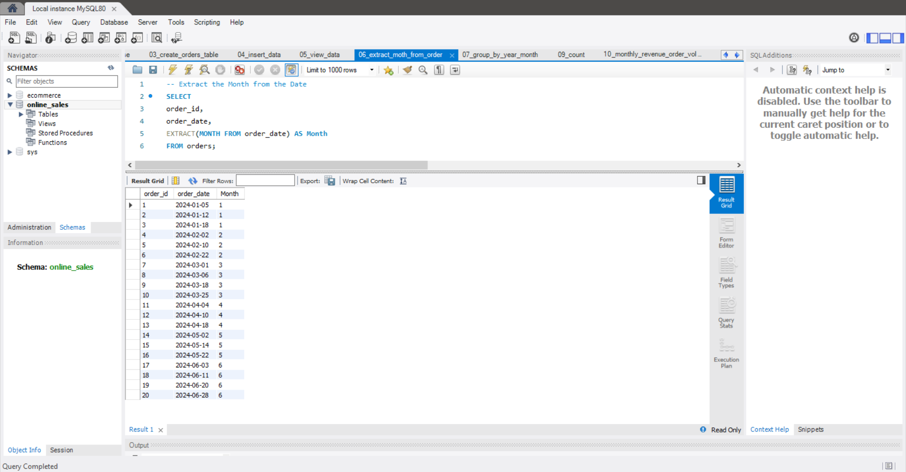
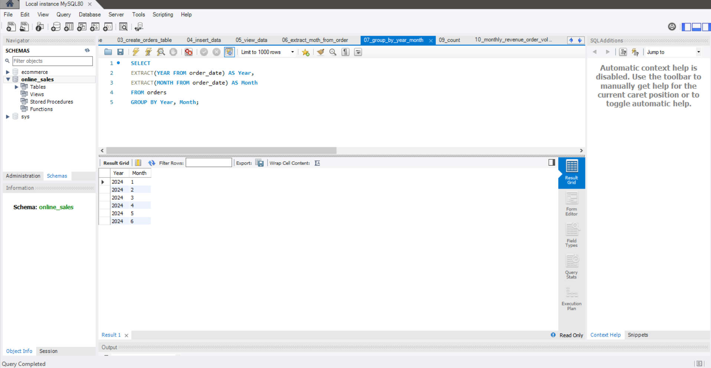
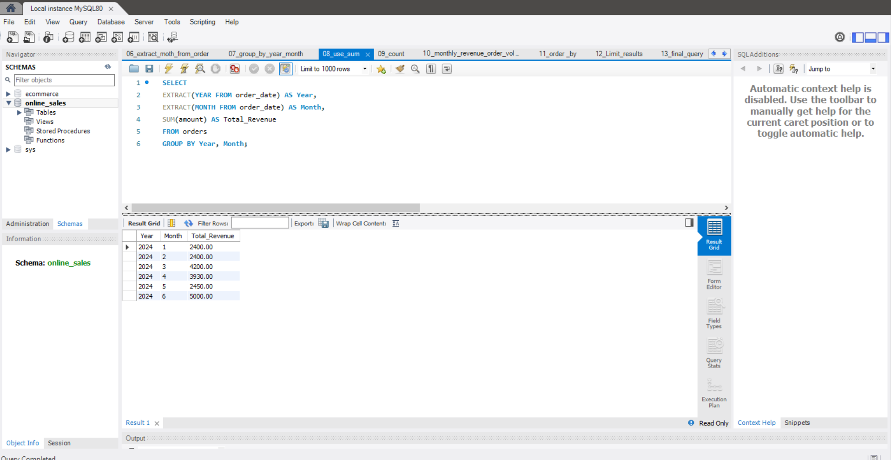
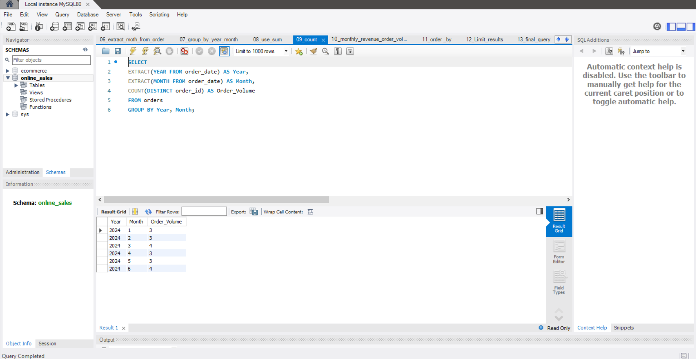
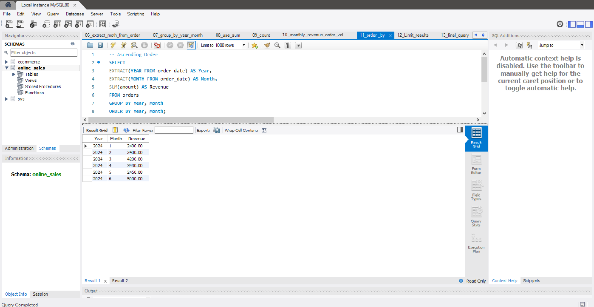
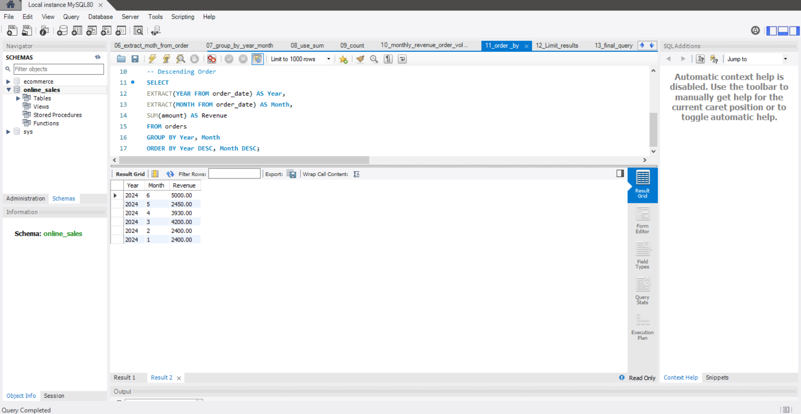
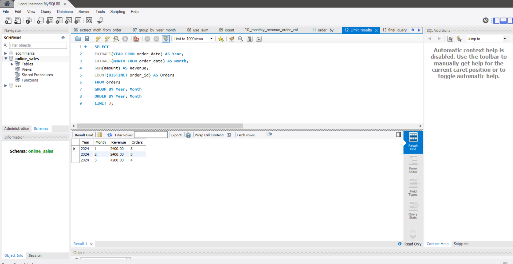

<h1>📊 Sales Trend Analysis using MySQL</h1>

Analyze monthly sales trends by calculating <strong>Total Revenue</strong> and
<strong>Order Volume</strong> using SQL aggregate functions and date extraction
techniques in MySQL Workbench.

<h2>📌 Project Overview</h2>

This project demonstrates how SQL can be used to analyze sales data stored in a
relational database. The analysis focuses on identifying monthly sales trends by
grouping orders based on year and month, calculating total revenue, and counting
the number of orders placed during each period.

The project is implemented using <strong>MySQL Workbench</strong> and utilizes
SQL functions such as <strong>EXTRACT()</strong>, <strong>SUM()</strong>,
<strong>COUNT()</strong>, <strong>GROUP BY</strong>,
<strong>ORDER BY</strong>, and <strong>LIMIT</strong>.

<h2>🎯 Objective</h2>

<ul>
<li>Analyze monthly sales performance.</li>
<li>Calculate total monthly revenue.</li>
<li>Determine monthly order volume.</li>
<li>Sort results chronologically.</li>
<li>Display sales trends for specific time periods.</li>
<li>Practice SQL aggregation and date functions.</li>
</ul>

<h2>🛠️ Tools & Technologies</h2>

<ul>
<li>MySQL</li>
<li>MySQL Workbench</li>
<li>SQL</li>
</ul>

<h2>🗂️ Dataset Information</h2>

<strong>Database Name</strong>

<pre><code>online_sales</code></pre>

<strong>Table Name</strong>

<pre><code>orders</code></pre>

<h3>Table Structure</h3>

<table>
<tr>
<th>Column</th>
<th>Data Type</th>
<th>Description</th>
</tr>

<tr>
<td>order_id</td>
<td>INT</td>
<td>Unique Order ID</td>
</tr>

<tr>
<td>order_date</td>
<td>DATE</td>
<td>Order Date</td>
</tr>

<tr>
<td>amount</td>
<td>DECIMAL(10,2)</td>
<td>Order Amount</td>
</tr>

<tr>
<td>product_id</td>
<td>INT</td>
<td>Product Identifier</td>
</tr>

</table>

<h2>📂 Project Structure</h2>

<pre>
Sales-Trend-Analysis/
│
├── Sales_Trend_Analysis.sql
├── README.md
├── screenshots/
│   ├── database.png
│   ├── table_data.png
│   ├── orders.png
│   ├──extract.png
│   ├──group_by.png
│   ├──sum.png
│   ├──count.png
│   ├──order_by1.png
│   ├──order_by2.png
│   ├── limit_results.png
│   └── final _query.png
└── dataset/
</pre>

<h2>🚀 Implementation Steps</h2>

<h3>Step 1 — Create the Database</h3>

Create a new database to store the sales records.

<h3>Step 2 — Select the Database</h3>

Set the newly created database as the active working database.

<h3>Step 3 — Create the Orders Table</h3>

Design the <strong>orders</strong> table with the required columns.

<ul>
<li>Order ID</li>
<li>Order Date</li>
<li>Sales Amount</li>
<li>Product ID</li>
</ul>

<h3>Step 4 — Insert Sample Sales Data</h3>

Populate the table with sample sales records covering multiple months.

<h3>Step 5 — Verify the Data</h3>

Display all records to ensure the data has been inserted successfully.

<h3>Step 6 — Extract Month from Order Date</h3>

Use the <strong>EXTRACT()</strong> function to retrieve the year and month from
the order date.

<strong>Functions Used</strong>

<ul>
<li>EXTRACT(YEAR FROM order_date)</li>
<li>EXTRACT(MONTH FROM order_date)</li>
</ul>

<h3>Step 7 — Group Records by Year and Month</h3>

Group all sales records according to their corresponding year and month.

<strong>SQL Concept</strong>

<ul>
<li>GROUP BY</li>
</ul>

<h3>Step 8 — Calculate Monthly Revenue</h3>

Use the <strong>SUM()</strong> aggregate function to calculate total monthly
revenue.

<strong>SQL Concept</strong>

<ul>
<li>SUM(amount)</li>
</ul>

<h3>Step 9 — Calculate Monthly Order Volume</h3>

Count the total number of unique orders placed every month.

<strong>SQL Concept</strong>

<ul>
<li>COUNT(DISTINCT order_id)</li>
</ul>

<h3>Step 10 — Generate Monthly Sales Report</h3>

Combine revenue and order volume into a single report containing:

<ul>
<li>Year</li>
<li>Month</li>
<li>Total Revenue</li>
<li>Order Volume</li>
</ul>

<h3>Step 11 — Sort the Results</h3>

Arrange the report chronologically using <strong>ORDER BY</strong>.
Sorting can also be performed in descending order for recent sales analysis.

<h3>Step 12 — Filter a Specific Time Period</h3>

Retrieve only the required number of records using
<strong>LIMIT</strong>.
This is useful for analyzing recent months or creating summary reports.

<h2>💡 SQL Concepts Used</h2>

<ul>
<li>CREATE DATABASE</li>
<li>USE</li>
<li>CREATE TABLE</li>
<li>INSERT INTO</li>
<li>SELECT</li>
<li>EXTRACT()</li>
<li>GROUP BY</li>
<li>SUM()</li>
<li>COUNT(DISTINCT)</li>
<li>ORDER BY</li>
<li>LIMIT</li>
</ul>

<h2>📈 Expected Output</h2>

<table>

<tr>
<th>Year</th>
<th>Month</th>
<th>Total Revenue</th>
<th>Order Volume</th>
</tr>

<tr>
<td>2024</td>
<td>1</td>
<td>2400</td>
<td>3</td>
</tr>

<tr>
<td>2024</td>
<td>2</td>
<td>2400</td>
<td>3</td>
</tr>

<tr>
<td>2024</td>
<td>3</td>
<td>4200</td>
<td>4</td>
</tr>

<tr>
<td>2024</td>
<td>4</td>
<td>3930</td>
<td>3</td>
</tr>

<tr>
<td>2024</td>
<td>5</td>
<td>2450</td>
<td>3</td>
</tr>

<tr>
<td>2024</td>
<td>6</td>
<td>5000</td>
<td>4</td>
</tr>

</table>

<h2>📊 Key Insights</h2>

<ul>
<li>Revenue is aggregated month-wise using the <strong>SUM()</strong> function.</li>
<li>Order volume is calculated using <strong>COUNT(DISTINCT order_id)</strong>.</li>
<li>Date values are separated into year and month using <strong>EXTRACT()</strong>.</li>
<li>Records are grouped efficiently using <strong>GROUP BY</strong>.</li>
<li>Sorting enables chronological sales trend analysis.</li>
<li><strong>LIMIT</strong> helps analyze specific time periods.</li>
</ul>

<table>

<tr>
<th>Screenshot</th>
<th>Image</th>
</tr>

<tr><td>Database Tables</td><td></td></tr>

<tr><td>View Dataset</td><td></td></tr>

<tr><td>EXTRACT the Month </td><td></td></tr>

<tr><td>GROUP BY </td><td></td></tr>

<tr><td>SUM()</td><td></td></tr>

<tr><td>COUNT</td><td></td></tr>

<tr><td>ORDER BY</td><td></td></tr>

<tr><td></td><td></td></tr>

<tr><td>Limit the Results</td><td></td></tr>

<tr><td>Final Query</td><td></td></tr>

</table>

<ul>
<li>Database Creation</li>
<li>Orders Table</li>
<li>Inserted Data</li>
<li>Monthly Revenue Query</li>
<li>Monthly Order Volume Query</li>
<li>Final Sales Trend Report</li>
</ul>

<h2>🎓 Learning Outcomes</h2>

<ul>
<li>Design relational databases using MySQL.</li>
<li>Create and populate SQL tables.</li>
<li>Extract year and month using EXTRACT().</li>
<li>Perform aggregation using SUM() and COUNT().</li>
<li>Group records using GROUP BY.</li>
<li>Sort query results using ORDER BY.</li>
<li>Filter records using LIMIT.</li>
<li>Generate business-oriented sales reports using SQL.</li>
</ul>

<h2>👨‍💻 Author</h2>

<strong>Sai Lakshmi NandiKatti</strong>  
Data Analyst | SQL Developer | Power BI Enthusiast

<h3>⭐ If you found this project helpful, don't forget to Star this repository!</h3>

